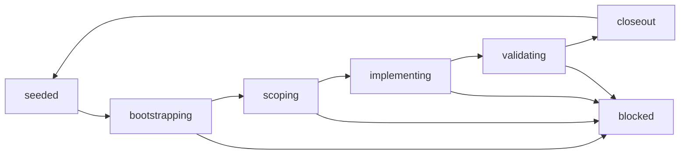

# RefactorFlow

RefactorFlow is a small, repo-agnostic workflow kit for AI-assisted, bounded
refactors.

It is designed for maintainers who want coding agents such as OpenAI Codex to
make progress without widening scope, skipping validation, or hiding decisions in
chat history. The kit keeps YAML authoritative, uses one obvious CLI entrypoint,
and generates lightweight Markdown sidecars for human handoff.

## Why RefactorFlow

- Keep each refactor slice narrow and reviewable.
- Make writable scope, validation, and risk checks explicit.
- Preserve a stable command surface for AI agents and humans.
- Install the same workflow contract into different repositories with minimal
  rewiring.

## Workflow Shape



## What You Get

- A manifest that defines the workflow contract.
- Policy files for protected surfaces, validation, risk, and runtime hubs.
- One concrete example lane for a bounded refactor slice.
- Session state and decision logging for AI-assisted execution.
- Prompt templates for bootstrap, closeout, and runtime-hub guidance.
- A single `scripts/workflow` command that emits JSON-first workflow state.
- An installer that copies the kit into another repository and rewrites the main
  branch, lane, and runtime-hub placeholders.

## Prerequisites

- `git`
- Node.js `18+`
- A repository where small, reviewable refactor slices are the goal

## Quickstart

```text
./scripts/workflow help --json
./scripts/workflow bootstrap --json
./scripts/workflow status --json
```

Read next:

1. `workflow/manifest.yaml`
2. `workflow/state/active-session.yaml`
3. `workflow/policy/*.yaml`
4. `WORKFLOW.md`

## Install Into Another Repo

```text
./scripts/install-workflow-kit --target /path/to/target/repo
```

Useful options:

- `--integration-branch <name>`
- `--baseline-branch <name>`
- `--lane-id <id>`
- `--lane-name <name>`
- `--runtime-hub <path>`
- `--repo-name <name>`
- `--force`
- `--json`

The installer copies the workflow tree and command surface into the target repo,
rewrites the main branch and lane placeholders, refreshes the seeded docs in the
destination, and stores this repository README as `README.refactorflow.md` so it
does not overwrite the target repo's own top-level README.

## AI Assistance

This repository was developed with AI assistance, including OpenAI Codex.
RefactorFlow is intended to work well with Codex and similar coding agents, but
AI output is never treated as authoritative on its own.

- Maintainer review, editing, and merge decisions remain human.
- Material AI assistance should be disclosed in pull requests.
- Contributors remain responsible for correctness, safety, and licensing.
- References to OpenAI Codex are descriptive and do not imply endorsement.

See `AI_POLICY.md` for the repository policy.

## Repository Guide

- `WORKFLOW.md`: human-readable operating guide
- `workflow/`: authoritative workflow state, policies, prompts, and templates
- `scripts/workflow`: JSON-first workflow CLI
- `scripts/install-workflow-kit`: installer for other repositories

## Design Rules

- Keep the kit repo-agnostic.
- Keep state machine transitions obvious.
- Prefer structured YAML over prose.
- Prefer one manifest and one active-session file over duplicated overlays.
- Treat protected surfaces as read-only unless an explicit exception is recorded.
- Keep runtime-hub guidance separate from general workflow policy.

## License

MIT
