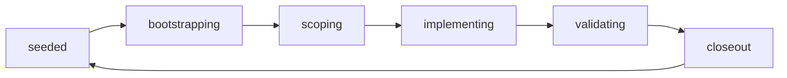

# RefactorFlow

[](https://github.com/oronculzac/refactorflow/actions/workflows/ci.yml)
[](LICENSE)

RefactorFlow is a small, repo-agnostic workflow kit for AI-assisted, bounded
refactors.

It gives coding agents such as OpenAI Codex a YAML-first state machine, explicit
writable scope, validation checkpoints, and lightweight handoff docs so they can
make progress without widening scope, skipping validation, or hiding decisions in
chat history.

## Best Fit

- You want AI-assisted refactors to stay narrow, reviewable, and auditable.
- You want one obvious command surface instead of scattered prompts and notes.
- You want workflow state to live in versioned files instead of chat memory.

## Not For

- Large multi-stream planning or project management.
- Teams looking for a full CI/CD orchestration framework.
- Repositories where broad autonomous edits are preferred over bounded slices.

## Why RefactorFlow

- Keep each refactor slice narrow and reviewable.
- Make writable scope, validation, and risk checks explicit.
- Preserve a stable command surface for AI agents and humans.
- Install the same workflow contract into different repositories with minimal
  rewiring.

## Workflow Shape



Any active state can move to `blocked` when a hard stop is recorded. After a
decision, the workflow resumes in the appropriate state.

## What You Get

- A manifest that defines the workflow contract.
- Policy files for protected surfaces, validation, risk, and runtime hubs.
- One concrete example lane for a bounded refactor slice.
- Session state and decision logging for AI-assisted execution.
- Prompt templates for bootstrap, closeout, and runtime-hub guidance.
- A single `scripts/workflow` command that emits JSON-first workflow state.
- Strict precommit enforcement, explicit protected-surface exceptions, and a
  lock file for state mutation safety.
- An installer that copies the kit into another repository and rewrites the main
  branch, lane, and runtime-hub placeholders.

## Prerequisites

- `git`
- Node.js `18+`
- A repository where small, reviewable refactor slices are the goal

## Quickstart

```text
./scripts/workflow help --json
./scripts/workflow bootstrap --json
./scripts/workflow status --json
./scripts/workflow begin-slice --scope src/ --hypothesis "narrow change" --json
./scripts/workflow precommit --strict --json
```

Install into a target repo:

```text
./scripts/install-workflow-kit --target /path/to/target/repo --repo-name my-repo
cd /path/to/target/repo
./scripts/workflow bootstrap --json
```

Read next:

1. `workflow/manifest.yaml`
2. `workflow/state/active-session.yaml`
3. `workflow/policy/*.yaml`
4. `WORKFLOW.md`

## Installer Options

```text
./scripts/install-workflow-kit --target /path/to/target/repo
```

Useful options:

- `--integration-branch <name>`
- `--baseline-branch <name>`
- `--lane-id <id>`
- `--lane-name <name>`
- `--runtime-hub <path>`
- `--repo-name <name>`
- `--pack <id>`
- `--force`
- `--json`

The installer copies the workflow tree and command surface into the target repo,
rewrites the main branch and lane placeholders, refreshes the seeded docs in the
destination, and stores this repository README as `README.refactorflow.md` so it
does not overwrite the target repo's own top-level README.

Target-specific packs under `workflow/packs/` can be activated during install.
For example, `--pack gem-cli` merges the `gem-cli` protected surfaces,
validation matrix, runtime-hub rules, and context hygiene settings into the
target workflow policy.

## AI Assistance

This repository was developed with AI assistance, including OpenAI Codex.
RefactorFlow is intended to work well with Codex and similar coding agents, but
AI output is never treated as authoritative on its own.

- Maintainer review, editing, and merge decisions remain human.
- Material AI assistance should be disclosed in pull requests.
- Contributors remain responsible for correctness, safety, and licensing.
- References to OpenAI Codex are descriptive and do not imply endorsement.

See `AI_POLICY.md` for the repository policy.

## Repository Guide

- `WORKFLOW.md`: human-readable operating guide
- `workflow/`: authoritative workflow state, policies, prompts, and templates
- `scripts/workflow`: JSON-first workflow CLI
- `scripts/install-workflow-kit`: installer for other repositories
- `CHANGELOG.md`: release-facing summary of notable changes

## Hard Enforcement

- `scripts/workflow precommit --strict --json` exits non-zero when the staged
  slice drifts outside the declared scope, generated docs are stale, or other
  required checks are missing.
- Touching a protected surface without a recorded exception blocks the session
  automatically during `precommit`.
- Record protected-surface exceptions explicitly with
  `scripts/workflow record-protected-surface --surface <path> --reason <text>`.
- `scripts/workflow closeout` now requires
  `--outcome <supported|refuted|inconclusive>`.
- Mutating commands use `workflow/state/.session.lock`; clear a stale lock with
  `scripts/workflow unlock --force`.

## Design Rules

- Keep the kit repo-agnostic.
- Keep state machine transitions obvious.
- Prefer structured YAML over prose.
- Prefer one manifest and one active-session file over duplicated overlays.
- Treat protected surfaces as read-only unless an explicit exception is recorded.
- Keep runtime-hub guidance separate from general workflow policy.

## License

MIT
